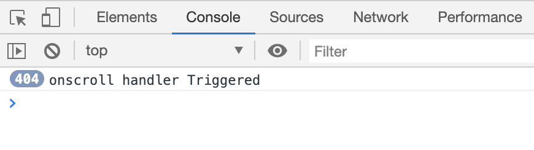

# Latest Starred Github Repos

Web app that lists the most starred Github repos that were created in the last 30 days.

### Technology Used in this project:
- Javascript (React)
- HTML/CSS

## Why React?
I used React in this project for the following reasons:
- I'm already familiar with the library.
- React is considered one of the most used front-end libraries/frameworks in today's web apps and has a community of millions of developers.
- I would have used Angular, But in this case it was going to be an overkill since Angular comes with a full package of features that are not required for this project.

## Project details:
The app consist of a list of repos fetched from Github API. By default, it will fetch the most starred repos in the last 30 days which you can change by passing a number (of days) value to `fetchRepos(page = 1, durationInDays = 30)` in "_./Utilities/fetchRepos.js_".

In App.js we are using a _useFetch_ hook that will fetch repos when the **page** state value changes.

We are implementing an infinite scroll by only loading pages when the user scrolls down and reach the bottom of the page. A _onscroll_ event is handled inside App component that updates the page value which in return will trigger the _useFetch_ to load and append new data.

Note: We're wrapping the event handler function in _debounce_ (a module from lodash library) to prevent the event handler from executing multiple times in fraction of a second.

**Without debounce**

**With debounce**

_fetchRepos.js_ utility also contains a _filterRepos_ function that will extract only relevant data to be displayed.

Thank you!
